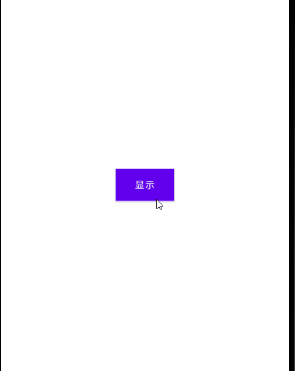

# android-tools

Android工具

## 一、 LoadingDialog 加载动画弹窗

1. 使用示例

``` java
    LoadingDialog loadingDialog = new LoadingDialog(MainActivity.this, "正在加载", R.drawable.anim_loading);
    //调用
    loadingDialog.show();
```

2. 效果


